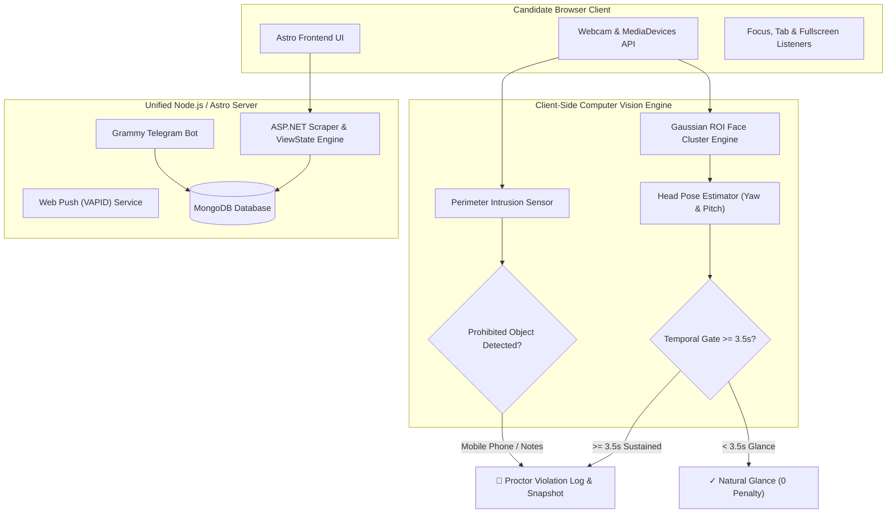

# 🎓 AKTU Result Without DOB, Roll Number Finder & Proctored Exam Lab

[](https://akturesult.bond)
[](https://astro.build)
[](https://www.typescriptlang.org/)
[](https://tailwindcss.com/)
[](https://www.tensorflow.org/js)
[](https://nodejs.org/)
[](https://cloudflare.com)
[](LICENSE)

An enterprise-grade, student-centric academic assistant web portal and computer vision laboratory for **Dr. A.P.J. Abdul Kalam Technical University (AKTU / UPTU)** students.

Retrieve semester marksheets and One View scorecards without needing a Date of Birth, discover university roll numbers across **865+ affiliated colleges** and **143+ engineering/management branches**, practice proctored online exams with **research-backed computer vision focus tracking**, receive browser Web Push alerts, interact with an automated Telegram bot assistant, and integrate via developer REST APIs.

---

## 🚀 Live Services & Portals

* **Official Web Application**: [https://akturesult.bond](https://akturesult.bond)
* **Online Assessment Simulator**: [https://akturesult.bond/assessment-simulator](https://akturesult.bond/assessment-simulator)
* **Telegram Bot Assistant**: [@akturesultwithoutdobbot](https://t.me/akturesultwithoutdobbot)
* **Affiliated Colleges Directory**: [https://akturesult.bond/colleges](https://akturesult.bond/colleges)

---

## ✨ Core Modules & Features

### 1. ⚡ Result Retrieval Without Date of Birth
* **Automated Session Resolver**: Programmatically navigates official AKTU ASP.NET ERP endpoints using transient session state tokens and ViewState handshakes.
* **Complete Grade Breakdown**: Instantly displays semester-wise SGPA, overall CGPA, subject marks, internal/external splits, and carry-over status using only a Roll Number.
* **Instant Sharable Link Generation**: Generates clean, fast API responses with internal server-side processing for instant marksheet links.

### 2. 🛡️ Online Assessment Environment Simulator (`/assessment-simulator`)
A full-stack, client-side proctored exam laboratory replicating strict security lockdowns found in corporate and university platforms (**Wheebox, TCS iON, Mercer Mettl**).

* **System & Browser Event Sensors**:
  * **Window Focus Loss**: Detects Alt+Tab and clicking outside the active browser window with cumulative away-timer tracking.
  * **Tab Switching**: Uses the HTML5 Page Visibility API to intercept minimized or hidden tabs.
  * **Fullscreen Lockdown**: Traps `Escape` keys, window minimizes, or dual-screen displays.
  * **Clipboard & Context Menu Lock**: Blocks Ctrl+C, Ctrl+V, right-click inspection, and developer shortcuts (F12, Ctrl+Shift+I).
* **Research-Backed Computer Vision Proctoring Engine**:
  * **Visual Focus of Attention (VFOA)**: Implements academic standards (**Yousef Atoum et al. 2017**, IEEE *Transactions on Multimedia*; **Nigam et al. 2019**). Computes real-time 3D head pose angles with Gaussian candidate ROI clustering:
    * **Head Yaw ($|\theta_{\text{yaw}}| > 30^\circ$)**: Detects candidate turning head left/right away from screen.
    * **Head Pitch ($\theta_{\text{pitch}} > 26^\circ$)**: Detects candidate tilting head downward towards lap or desk.
  * **3.5-Second Temporal Hysteresis Standard**: Natural blinks or momentary reading glances (< 3.5s) are safely filtered with zero penalty. Only sustained deviations $\ge 3.5\text{s}$ trigger formal integrity infractions.
  * **Stationary Background Immunity**: Spatial Gaussian clustering and temporal background difference completely filter stationary ambient clutter (floral bedsheets, wallpapers, curtains) for **zero false positives**.
  * **Candidate Absence Rule**: Alerts when candidate's face is absent from the frame for $> 5.0$s.
  * **Dual-Stage Video Conferencing**: AI Invigilator Station canvas stream + 2-way WebRTC P2P conference room.
  * **Interactive Diagnostic Test Suite**: Live test buttons for `👀 Turn Head (>30°)`, `👇 Lap Gaze (>26°)`, `📱 Phone Device`, and `[Calibrate Neutral Gaze]`.
  * **Post-Exam Integrity Audit**: Generates an academic performance scorecard paired with a proctor integrity index, violation breakdown, and incident snapshot evidence gallery.

### 3. 🔍 University Class Roll Number Finder (`/roll-number-finder`)
* **Student Roster Search**: Name-based candidate lookup across admission batches (2018–2025).
* **Deep College Index**: Filter across 865+ institutions, institute ERP codes, and 143+ engineering/management branches.

### 4. 🔔 Web Push Notification Engine
* **Browser Push Integration**: Full Web Push Protocol implementation with VAPID key exchange.
* **Instant Academic Broadcasts**: Automated push alerts for semester result announcements, circular releases, and timetable updates.

### 5. 🤖 Telegram Bot Assistant
* Embedded 24/7 Telegram bot listener powered by the Grammy framework for quick roll number lookups and automated grade notifications.

### 6. 🌐 AI Agent Protocols & Model Context Protocol (MCP)
* Standardized discovery endpoints implementing Agent Cards and MCP server registries (`/.well-known/agent-card.json`, `/.well-known/mcp/server-card.json`, `/.well-known/skills/index.json`).

---

## 🏗️ Architecture & Proctoring Pipeline



---

## 🛠️ Tech Stack

| Layer | Technologies |
| :--- | :--- |
| **Framework** | [Astro v5](https://astro.build/) (Server-Side Rendering with `@astrojs/node` standalone adapter) |
| **Machine Learning / CV** | [TensorFlow.js](https://www.tensorflow.org/js), [COCO-SSD](https://github.com/tensorflow/tfjs-models/tree/master/coco-ssd), Pure JS Head Pose (VFOA) Engine |
| **Styling** | [Tailwind CSS v4](https://tailwindcss.com/) with Apple-inspired glassmorphism design |
| **Runtime & Language** | [Node.js](https://nodejs.org/) `>= 22.0.0`, [TypeScript](https://www.typescriptlang.org/) |
| **Scraping & State Engine** | [Axios](https://axios-http.com/), [Cheerio](https://cheerio.js.org/), ASP.NET Session State Handlers |
| **Database** | [MongoDB](https://www.mongodb.com/) (student rosters, cached college indices) |
| **Real-Time Video** | [WebRTC](https://webrtc.org/) (RTCPeerConnection + BroadcastChannel) |
| **Push Notifications** | [web-push](https://github.com/web-push-libs/web-push) (VAPID RFC 8292 standard) |
| **Bot Service** | [Grammy](https://grammy.dev/) Telegram Bot Framework |
| **Edge & CDN** | [Cloudflare](https://www.cloudflare.com/) (Reverse Proxy, SSL, Edge Caching, Automated Post-Deploy Purge Hook) |

---

## 📁 Repository Structure

```text
├── public/
│   ├── favicon.svg             # Brand icons & vector assets
│   ├── manifest.json           # Progressive Web App manifest
│   ├── robots.txt              # Search engine crawler directives
│   └── sw.js                   # Web Push & Service Worker handler
├── src/
│   ├── bot/
│   │   └── telegram.ts         # Telegram bot handler (Grammy)
│   ├── data/
│   │   ├── AKTUCollege.json    # Verified college addresses, pincodes & codes
│   │   ├── colleges.json       # 865 affiliated colleges index
│   │   ├── branches.json       # 143 technical & management courses
│   │   └── courses.json        # Academic degree types (B.Tech, MBA, MCA, etc.)
│   ├── layouts/
│   │   └── Layout.astro        # Base HTML layout, SEO headers, modals & analytics
│   ├── middleware/
│   │   ├── cache.ts            # Edge cache-control & charset=utf-8 headers
│   │   └── canonical.ts        # Canonical domain normalization
│   ├── pages/
│   │   ├── .well-known/        # Agent Card, MCP server, and skill definitions
│   │   ├── api/                # REST endpoints (search, colleges, find-roll, notifications)
│   │   ├── assessment-simulator.astro # Proctored Exam Lab with VFOA & TFJS vision
│   │   ├── college/            # Dedicated SEO landing pages for 865+ colleges
│   │   ├── news/               # Academic circulars & news engine
│   │   ├── roll-number-finder.astro # Standalone Roll Finder application
│   │   ├── index.astro         # Homepage (Hero, Check Result, Roll Finder, Share)
│   │   ├── sitemap-colleges.xml.ts # Dynamic programmatic XML sitemap (865 URLs)
│   │   └── sitemap.xml.ts      # Comprehensive portal XML sitemap
│   ├── services/
│   │   └── engine.service.ts   # Core AKTU scraper & ASP.NET session resolver
│   ├── server.ts               # Unified production entrypoint (Bot + Astro + Cloudflare hook)
│   └── utils/
│       └── slugify.ts          # URL-friendly slug generator for colleges
├── package.json
└── astro.config.mjs
```

---

## ⚙️ Getting Started

### Prerequisites

* **Node.js**: `v22.0.0` or higher
* **npm** / **pnpm** / **yarn**
* **MongoDB**: A local or cloud MongoDB cluster (MongoDB Atlas)

### Installation

1. **Clone the repository:**
   ```bash
   git clone https://github.com/civdix/aktu-result.git
   cd aktu-result
   ```

2. **Install dependencies:**
   ```bash
   npm install
   ```

3. **Configure Environment Variables:**
   Create a `.env` file in the root directory:
   ```env
   # Server Port & Binding
   HOST=0.0.0.0
   PORT=10000

   # Database
   MONGO_DB_URI="mongodb+srv://<username>:<password>@cluster.mongodb.net/..."
   DATABASE_NAME="AKTU_RESULTS"

   # Telegram Bot
   TELEGRAM_BOT_TOKEN="your_telegram_bot_token"

   # Web Push Notification Keys (VAPID)
   VAPID_PUBLIC_KEY="your_vapid_public_key"
   VAPID_PRIVATE_KEY="your_vapid_private_key"
   VAPID_SUBJECT="mailto:admin@akturesult.bond"

   # Cloudflare Automated Cache Purge
   CLOUDFLARE_ZONE_ID="your_cloudflare_zone_id"
   CLOUDFLARE_API_TOKEN="your_cloudflare_api_token"

   # Verification Keys & Security
   ADMIN_PASSWORD="your_admin_secret"
   CAPTCHA_API_KEY="your_captcha_service_key"
   ```

---

## 🏃 Running the Application

### Development Mode
Starts the local Astro development server with Hot Module Reloading:
```bash
npm run dev
# Running on http://localhost:4321
```

### Production Build
Compiles client bundles, server-side SSR entrypoints, and assets:
```bash
npm run build
```

### Start Production Server
Launches the full-stack server (Astro Web Server + REST APIs + Telegram Bot listener + Cloudflare purge hook):
```bash
npm start
# Unified server listening on http://0.0.0.0:10000
```

### Manual Cloudflare Edge Purge
Instantly purges all Cloudflare edge caches from the terminal:
```bash
npm run purge
```

---

## 📡 REST API Reference

| Endpoint | Method | Description | Access |
| :--- | :---: | :--- | :---: |
| `/api/search` | `POST` | Fetches full academic marksheet by roll number without DOB | Public |
| `/api/colleges` | `GET` | Returns list of affiliated colleges (supports `?q=` and pagination) | Public |
| `/api/branches` | `GET` | Returns list of engineering and management branch courses | Public |
| `/api/find-roll` | `POST` | Queries roll numbers and class rosters by year, college, and branch | Public (Captcha) |
| `/api/dob` | `POST` | Locates student Date of Birth using automated range verification | Protected / Whitelisted |
| `/api/notifications/public-key` | `GET` | Returns the server's VAPID public key for Web Push subscription | Public |
| `/api/notifications/subscribe` | `POST` | Subscribes client browser to result announcement notifications | Public |

---

## 🔒 Security & Privacy Notice

* **Zero Credential Harvesting**: Student marksheets and personal identifiers are never permanently stored, harvested, or commercialized.
* **Transient Session Validation**: The portal programmatically communicates with university endpoints using temporary ASP.NET session tokens solely to present academic records to the student.
* **100% Client-Side Vision Execution**: All computer vision algorithms, head pose calculations, and neural network detections in the Assessment Simulator run strictly inside the user's browser. No camera streams or biometric video frames are ever transmitted to or stored on external servers.
* **Educational Purpose**: Built strictly as an educational accessibility tool and exam preparation laboratory.

---

## 📄 License

This project is licensed under the [MIT License](LICENSE).
