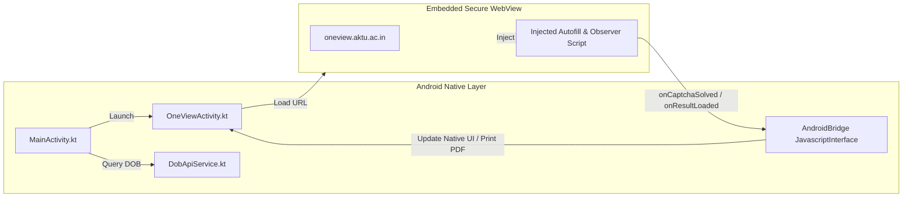

# 📱 Android App & CI/CD Pipeline

The project includes an Android native client (`aktu-android-app`) that provides an automatic mobile scorecard browser, PDF marksheet generation, and seamless CAPTCHA handling.

---

## 🏗️ Architecture: Hybrid Native + WebView Bridge



---

## 🔑 Key Android Features

1. **Automatic Form Filling**: When the student enters their roll number in `MainActivity`, the app checks the backend for the verified DOB. Once found, it opens `OneViewActivity` and automatically types the Roll Number and DOB into the WebForms inputs.
2. **reCAPTCHA Token Extraction**: An injected JavaScript observer monitors the `#g-recaptcha-response` DOM element. As soon as the student taps the checkbox and the token is issued, the bridge captures the token, submits the form, and syncs the token with the backend.
3. **Responsive Dark Mode Injection**: The WebView injects custom CSS into the AKTU page, transforming the legacy 2005-era desktop layout into a modern dark-mode mobile interface with collapsible semester accordions.
4. **Native PDF Printing**: Utilizes Android's `PrintManager` and `PrintAttributes` to export marksheets directly to PDF or physical printers.

---

## ⚙️ GitHub Actions CI/CD Pipeline (`build-apk.yml`)

The Android application is automatically built and tested on every push to `main` via GitHub Actions:

```yaml
name: Build Android APK

on:
  push:
    branches: [ main, master ]
  workflow_dispatch:

jobs:
  build:
    runs-on: ubuntu-latest

    steps:
      - name: Checkout repository
        uses: actions/checkout@v4

      - name: Set up JDK 17
        uses: actions/setup-java@v4
        with:
          distribution: 'zulu'
          java-version: '17'

      - name: Setup Android SDK
        uses: android-actions/setup-android@v3
        with:
          packages: 'platform-tools'

      - name: Generate & Grant execute permission for gradlew
        run: |
          cd aktu-android-app
          if [ ! -f gradlew ]; then
            gradle wrapper --gradle-version 8.5
          fi
          chmod +x gradlew

      - name: Build Debug APK with Gradle
        run: |
          cd aktu-android-app
          ./gradlew assembleDebug --stacktrace
        env:
          ANDROID_HOME: /usr/local/lib/android/sdk

      - name: Upload APK Artifact
        uses: actions/upload-artifact@v4
        with:
          name: AKTU-Result-Finder-APK
          path: aktu-android-app/app/build/outputs/apk/debug/*.apk
```

### Critical CI/CD Troubleshooting Note:
* Always specify `packages: 'platform-tools'` in `android-actions/setup-android@v3` to prevent the action from attempting to download the obsolete `tools` package which Google removed from its repository.
