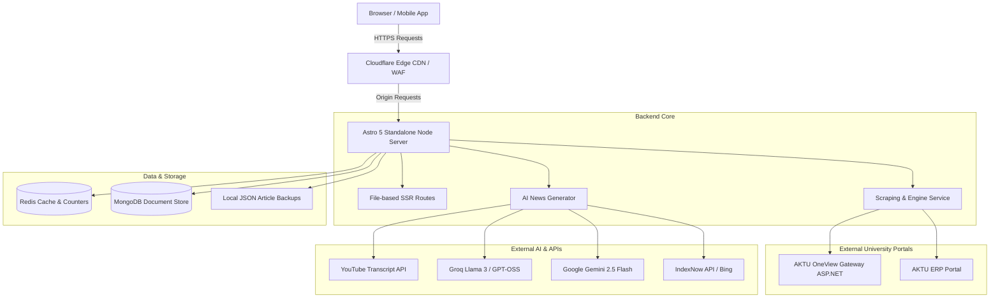

# 🏛️ Architecture & Tech Stack

The AKTU Student Portal is engineered as a hybrid SSR (Server-Side Rendered) web application designed for high concurrency, ultra-low Time-To-First-Byte (< 50ms), and real-time integration with university legacy gateways.

---

## 🛠️ Technology Stack



| Layer | Component | Description |
| :--- | :--- | :--- |
| **Edge & CDN** | Cloudflare | Global Anycast DNS, SSL termination, DDoS mitigation, and edge asset caching. |
| **Web Framework** | Astro 5 | Server-side rendering mode (`output: 'server'`) with `@astrojs/node` standalone adapter. |
| **Styling** | Tailwind CSS v4 | Utility-first styling with `@tailwindcss/vite` and glassmorphic UI tokens. |
| **Language** | TypeScript 5.3+ | End-to-end type safety for interfaces, database models, and API responses. |
| **Database** | MongoDB 5.7+ | Student records collection, verified DOB lookups, and article database. |
| **In-Memory Store** | Redis (ioredis) | Real-time active readers window, 24-hour article view deduplication, live ticker counters. |
| **AI Synthesis** | Groq & Gemini | Multi-model fallback pipeline producing 1,500+ word structured academic articles. |
| **Bot Service** | Grammy | Telegram bot running concurrently with the web server via `src/server.ts`. |

---

## 📂 Source Code Structure

```text
AKTU-DOB-FINDER/
├── .github/
│   └── workflows/
│       ├── build-apk.yml              # CI/CD: Android debug APK build & artifact upload
│       └── purge-cloudflare.yml       # CI/CD: Cloudflare edge cache purge
├── data/
│   ├── articles/                      # Local JSON backup of all published news articles
│   ├── colleges.json                  # Catalog of 865+ colleges with names and codes
│   ├── branches.json                  # 143 academic courses and branch specifications
│   └── AKTUCollege.json               # Detailed institution addresses and pincodes
├── public/
│   ├── .well-known/
│   │   ├── agent-card.json            # A2A Agent Card discovery
│   │   └── ai-catalog.json            # AI Agent Catalog
│   ├── robots.txt                     # RFC 9309 search engine directives & AI opt-outs
│   ├── ads.txt                        # Google AdSense publisher verification
│   └── site.webmanifest               # PWA configuration
├── src/
│   ├── database/
│   │   └── database.service.ts        # MongoDB client connection pool & query helpers
│   ├── layouts/
│   │   └── Layout.astro               # Global HTML head, SEO tags, schema markup, nav & footer
│   ├── pages/
│   │   ├── api/                       # REST endpoints (search, dob, find-roll, articles, admin)
│   │   ├── college/
│   │   │   └── [slug].astro           # Dynamic SEO profile for each affiliated college
│   │   ├── news/
│   │   │   ├── index.astro            # Academic news hub
│   │   │   └── [slug].astro           # News article reader with JSON-LD NewsArticle schema
│   │   ├── a2a.ts                     # Agent-to-Agent interface endpoint
│   │   ├── aktu-erp-result.astro      # ERP marksheet search view
│   │   ├── aktu-result-without-date-of-birth.astro # Fast DOB-free result search
│   │   ├── index.astro                # Home landing page with dual-mode search & live tickers
│   │   ├── oneview.astro              # Embedded live OneView portal gateway
│   │   ├── sitemap.xml.ts             # Core XML sitemap endpoint
│   │   ├── sitemap-colleges.xml.ts    # Colleges directory XML sitemap endpoint
│   │   └── sitemap-news.xml.ts        # Google News XML sitemap endpoint
│   └── services/
│       ├── article.service.ts         # Article CRUD, MongoDB sync, and view incrementing
│       ├── engine.service.ts          # Core AKTU scraping & ViewState extraction
│       ├── news-generator.service.ts  # Automated YouTube scraping & AI journalism synthesis
│       └── redis.service.ts           # Redis connection manager & sliding window rate counters
```

---

## 🚀 Server Bootstrap Flow (`src/server.ts`)

When deployed to production:
1. Loads environment variables via `dotenv/config`.
2. Verifies connectivity to MongoDB and Redis.
3. Initializes the Grammy Telegram Bot instance if `TELEGRAM_BOT_TOKEN` is present.
4. Boots the Astro Node.js standalone HTTP listener on `PORT` (default `4321`).
5. Executes an asynchronous Cloudflare cache purge hook to ensure fresh assets are served immediately.
