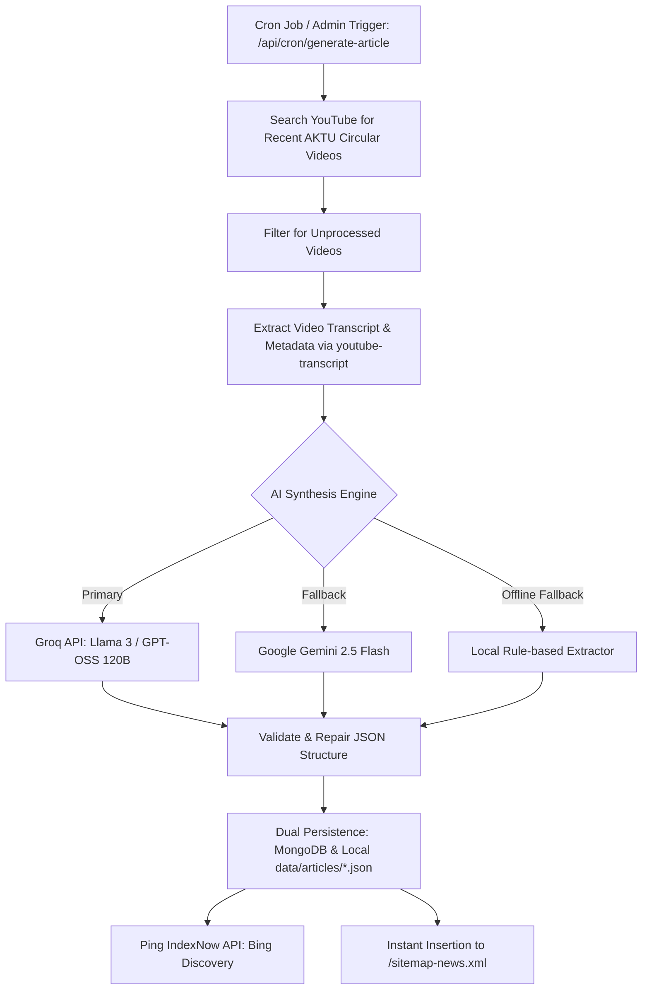

# 📰 Automated News Pipeline

The News Engine automatically discovers university notifications, circulars, and exam updates from verified educational channels, synthesizing them into 1,500+ word journalistic articles that meet Google News and Google Discover ranking standards.

---

## 🔄 End-to-End Pipeline Workflow



---

## ✍️ Editorial Architecture & Quality Standards

To comply with Google's **Helpful Content Guidelines** and avoid *Scaled Content Abuse* penalties, every generated article follows a strict journalistic framework:

1. **Inverted Pyramid Lead**: Factual lead paragraphs answering *Who, What, When, Where, Why* immediately.
2. **Executive Summary**: 4–6 actionable student takeaways.
3. **Circular Dissection**: Academic ordinance references, examination bylaws, and administrative consequences.
4. **Branch & Batch Breakdown**: Clear segregation of impacts for B.Tech, B.Pharma, MBA, MCA, Regular, and Carry-Over (COP) students.
5. **Timeline & Deadlines Table**: Markdown table detailing stages, deadlines, and official portals.
6. **Action Guide**: Numbered step-by-step procedures for students.
7. **Verification & Fact-Check**: Attribution to the primary circular and original YouTube broadcast observer.
8. **Student FAQs**: 4–5 questions with authoritative 50–75 word answers targeting Google *People Also Ask* snippet real estate.

---

## ⚡ IndexNow Instant Discovery

When an article is published, the server immediately submits the URL to Bing via the **IndexNow Protocol**:

```typescript
const payload = {
  host: 'akturesult.bond',
  key: process.env.INDEXNOW_KEY,
  keyLocation: 'https://akturesult.bond/c79f2e4b8a1d0f5e3b6a9c2d1e4f0a8b.txt',
  urlList: [`https://akturesult.bond/news/${article.slug}`]
};

await fetch('https://api.indexnow.org/indexnow', {
  method: 'POST',
  headers: { 'Content-Type': 'application/json' },
  body: JSON.stringify(payload)
});
```

---

## 🔒 Security & Admin Dashboard

* **Endpoint**: `/api/cron/generate-article`
* **Authorization**: Requires `Authorization: Bearer <CRON_SECRET>` or `?secret=<CRON_SECRET>` query parameter.
* **Admin Interface**: `/admin` provides a dedicated dashboard to trigger generation, monitor pipeline status, view read counters, and delete old articles.
