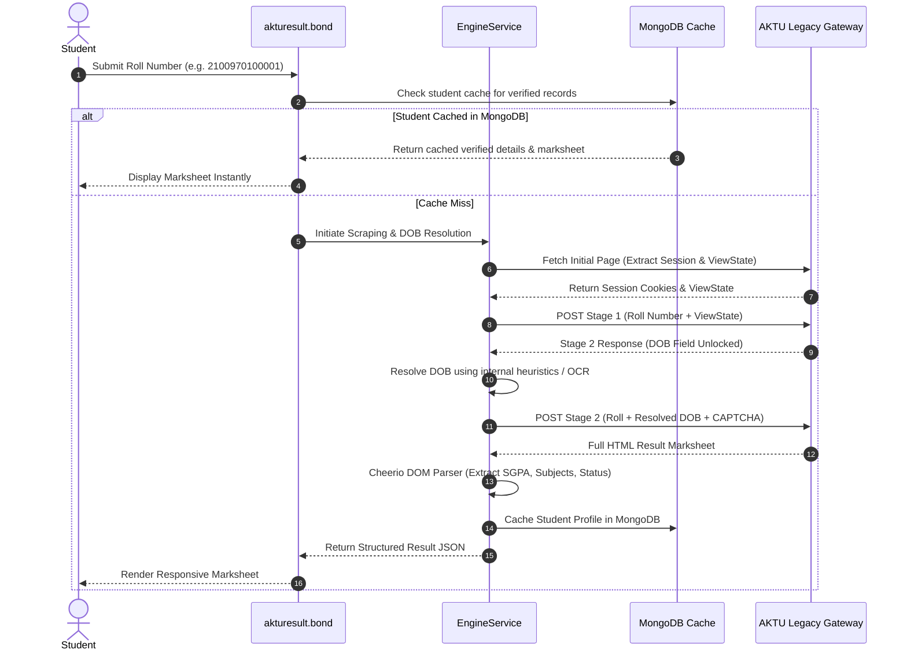

# ⚡ Result Engine & OneView Automation

The core capability of the portal is retrieving student examination marksheets, semester SGPA/CGPA ledgers, and verified academic details without requiring the student to remember their Date of Birth.

---

## 🎯 The Challenge: AKTU's Legacy Gateways

The official AKTU OneView portal (`oneview.aktu.ac.in`) is built on legacy Microsoft ASP.NET WebForms technology:
1. **ViewState & EventValidation**: Every form submission requires cryptographically matched `__VIEWSTATE`, `__EVENTVALIDATION`, and `__VIEWSTATEGENERATOR` hidden fields.
2. **Two-Stage Form Flow**:
   * *Stage 1*: Enter Roll Number and click "Proceed" (`btnProceed`).
   * *Stage 2*: Enter Date of Birth (`txtDOB`) and solve a Google reCAPTCHA v2 / manual CAPTCHA before clicking "Search" (`btnSearch`).
3. **DOB Barrier**: Many university students forget their exact registered date of birth entered during initial registration (often due to clerical discrepancies in high school records), permanently blocking access to their marksheets.

---

## 🔍 How Result Retrieval Without DOB Works



---

## 📊 Result Data Model

The marksheet parser converts messy HTML tables into a structured `Student` TypeScript interface:

```typescript
export interface Student {
  name: string;
  fatherName: string;
  rollNumber: string;
  enrollmentNumber: string;
  institute: string;
  course: string;
  branch: string;
  hindiName?: string;
  gender?: string;
  semesters: Semester[];
  totalMarksObtained?: number;
  maxTotalMarks?: number;
  percentage?: string;
  cgpa?: string;
  divisionAwarded?: string;
  academicHistory?: AcademicHistory[];
}

export interface Semester {
  semesterNumber: number;
  totalMarks: number;
  maxMarks: number;
  sgpa: string;
  status: string; // "PASS", "PCP", "PWG", "FAIL"
  subjects: Subject[];
}
```

---

## 🛡️ Anti-Penalty User Experience

In earlier versions, a 5-second interstitial countdown was used before revealing marksheet results. This caused ranking drops due to Google's **Intrusive Interstitials** penalty.

* **Immediate Display**: The result handler now displays verified marksheet data **instantly upon response arrival**.
* **Zero Interstitial Walls**: Advertisements are embedded natively above and below the marksheet ledger without blocking user interaction or forcing delay timers.
* **1-Tap PDF Printing**: Students can print or download their scorecard cleanly with styled CSS `@media print` rules.
